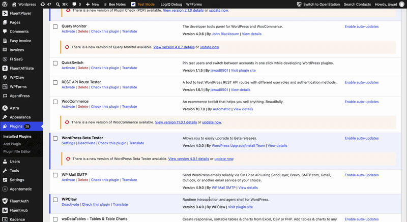

# QuickSwitch

Pin test users and switch between WordPress accounts in one click while developing plugins.

**Download:** [Latest release](https://github.com/jawad0501/quickswitch/releases/latest)

## Demo

  

<em>Hover Switch User → browse pinned users → switch in one click</em>

## Why QuickSwitch?

When you build WordPress plugins, you often jump between an admin account and a handful of fixed test users — Editor, Subscriber, Customer, custom roles. Existing user switching plugins work, but you still hunt through the Users list every session.

QuickSwitch adds a pinning layer on top of a complete, standalone switching implementation built for developer workflows.

## Features

### Switching

- **Switch To** — log in as another user instantly
- **Switch Back** — return to your original account
- **Switch Off** — log out while keeping the ability to switch back
- Standalone auth-cookie and session-token implementation (no dependency on User Switching or similar plugins)
- Smart redirects — if the target user cannot access the page you were on, they are sent to the dashboard or homepage instead of an unauthorized error

### Pinning

- Pin or unpin users from the **Users** list row actions or the admin bar **All users** tab
- Pins are stored per admin in usermeta (no custom database tables)

### Admin bar panel

- **Switch User** menu on all wp-admin screens — opens on hover
- **Pinned** and **All users** tabs
- Search users by username or email
- Infinite scroll (20 users at a time)
- Each row shows avatar, name, role, login, email, and **Switch To**
- Click a user row to open their profile; use **Switch To** to switch accounts
- Fixed-height, scrollable panel

### Profile & user screens

- **Switch To** button on user edit screens (next to **Add User**)
- **Switch To** button in the Personal Options section of user profiles

## Requirements

- WordPress 6.2+
- PHP 8.0+

## Installation

1. Download the latest release zip from [GitHub Releases](https://github.com/jawad0501/quickswitch/releases).
2. In WordPress, go to **Plugins → Add New → Upload Plugin** and install the zip.
3. Activate QuickSwitch.
4. Go to **Users**, pin your test accounts using the **Pin** row action.
5. During testing, open **Switch User** from the admin bar and click a pinned account.

Alternatively, clone this repo into `wp-content/plugins/quickswitch` and activate it.

## Permissions

Users with the `edit_users` capability can pin users and switch accounts. Switch back uses cookie authentication and does not require the switched-in user to have elevated capabilities.

## FAQ

**Does this replace User Switching?**  
Yes. QuickSwitch is standalone and implements its own switch-to, switch-back, and switch-off flow.

**Are pins shared between admins?**  
No. Pins are stored against your own user account.

**Does QuickSwitch work on Multisite?**  
Multisite is not a priority for v1. It may work incidentally but is not tested or supported.

## What QuickSwitch intentionally leaves out

No audit log, multisite-specific code, CLI, REST API layer, or dependency on other switching plugins. It is a small developer tool, not a platform plugin.

## Changelog

### 1.1.5

- Fix admin bar panel JavaScript error that showed "No users found"

### 1.1.4

- Show login and email on separate lines so long addresses are not truncated

### 1.1.3

- Open Switch User panel on hover instead of click
- Compact admin bar panel layout with email and role per user
- Click a user row to open their profile; use Switch To to switch accounts

### 1.1.2

- Add Switch Off to the profile menu when logged in as admin; hide it while switched (use the Switched to… menu instead)

### 1.1.1

- Show Switch Off for any switched user, not only accounts with `edit_users`
- Add switch-back links on the login screen, site footer, and Meta widget after Switch Off
- Allow switch back while logged out via admin-post nopriv handler

### 1.1.0

- Remove Users → QuickSwitch settings page; pin and unpin from the Users list or admin bar panel
- Show pin/unpin success notices globally in wp-admin

See [readme.txt](readme.txt) for the full changelog.

## License

GPL v2 or later. See [LICENSE](https://www.gnu.org/licenses/gpl-2.0.html).

## Credits

Inspired by the user-switching pattern established in the WordPress ecosystem, particularly the work of [John Blackbourn](https://profiles.wordpress.org/johnbillion/) on [User Switching](https://wordpress.org/plugins/user-switching/).

If your use case is general-purpose user switching — multisite, WooCommerce, enterprise compatibility — use the original. If you are a plugin developer switching between the same test users all day, QuickSwitch is built for that workflow.
